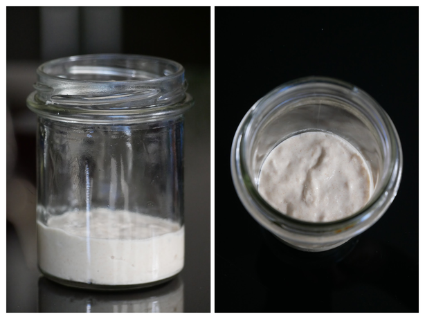

# Maturité du levain en images

## Après un rafraîchi

Après un rafraîchi, le levain est dense. Il a l'aspect d'une pâte à pain mollette.

## À son maximum de pousse

Quelques heures après le rafraîchi (de l'ordre de deux à six), le levain prend du volume
(de l'ordre de deux à trois fois le volume au moment du rafraîchi). Sa surface est bombée.
On observe de nombreuses bulles.

C'est le moment idéal pour l'utiliser et faire du pain.

## Redescente

Une fois le maximum de pousse atteint, les bactéries ralentissent puis cessent leur
développement. Le levain redescend petit à petit. Sa surface se creuse et prend un
aspect bosselé. Les bulles se font plus discrètes et leur diamètre diminue.

On observe les traces du maximum pousse sur la paroi du bocal (signe que le levain
n'est plus en croissance mais bien en décroissance).

## Levain retombé

Le levain finit par retomber totalement. Les bulles sont de plus en plus difficiles
à distinguer.

À ce stade, il est trop tard pour utiliser le levain pour faire du pain : son activité
fermentaire sera trop faible. Pour l'utiliser, un rafraîchi supplémentaire est nécessaire.

