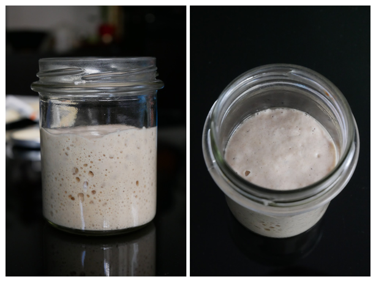
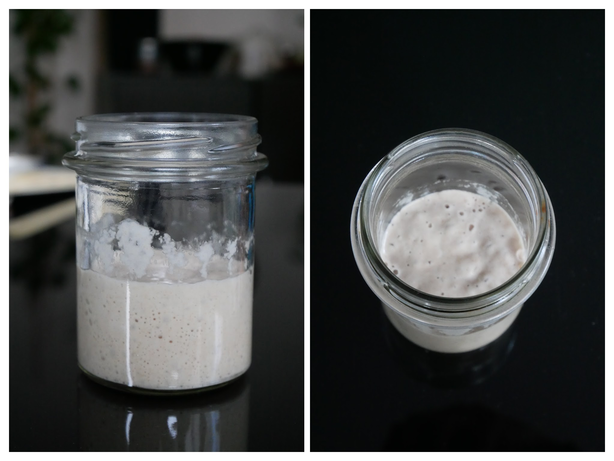

# Levain

## Rafraîchi

Un levain est contitué d'organismes vivants qui doivent se nourrir. Apporter cette nourriture
au levain s'appelle le _rafraîchi_.

### Rafraîchi d'entretien

Même si vous n'utilisez pas votre levain, il vous faut le rafraîchir pour le garder en vie. Pour
cela, vous devez en doubler le poids périodiquement.

> *Exemple*
>
> Si votre levain pèse 100g, vous devez ajouter :
>
> * 50g de farine
> * 50g d'eau

Si vous conservez votre levain à température ambiante, comptez un rafraîchi tous les 2 à 4 jours.

Si vous le conservez au réfrigérateurs, toutes les deux semaines est suffisant.

> *Note*
>
> Le froid ne permet par le même développement de vos bactéries lactiques : en mettant votre levain
> au froid, vous en changez la composition.

### Rafraîchi pour faire du pain

Avant de faire du pain, il est bon de stimuler le levain un peu plus (on parle d'augmenter
l'activité fermentaire). Pour cela, on rapproche les raffraîchis pour en faire toutes les 6 à 12h.

Le dernier rafraîchi est à faire entre 3 et 5 heures avant de commencer la pâte à pain.

## Maturité du levain en images

### Après un rafraîchi

Après un rafraîchi, le levain est dense. Il a l'aspect d'une pâte à pain mollette.

### À son maximum de pousse

Quelques heures après le rafraîchi (de l'ordre de deux à six), le levain prend du volume
(de l'ordre de deux à trois fois le volume au moment du rafraîchi). Sa surface est bombée.
On observe de nombreuses bulles.

C'est le moment idéal pour l'utiliser et faire du pain.

### Redescente

Une fois le maximum de pousse atteint, les bactéries ralentissent puis cèssent leur
développement. Le levain redescend petit à petit. Sa surface se creuse et prend un
aspect bosselé. Les bulles se font plus discrètes et leur diamètre diminue.

On observe les traces du maximum pousse sur la paroi du bocal (signe que le levain
n'est plus en croissance mais bien en décroissance).

### Retombé

Le levain finit par retomber totalement. Les bulles sont de plus en plus difficiles
à distinguer.

À ce stade, il est trop tard pour utiliser le levain pour faire du pain : son activité
fermentaire sera trop faible. Pour l'utiliser, un rafraîchi supplémentaire est nécesaire.

